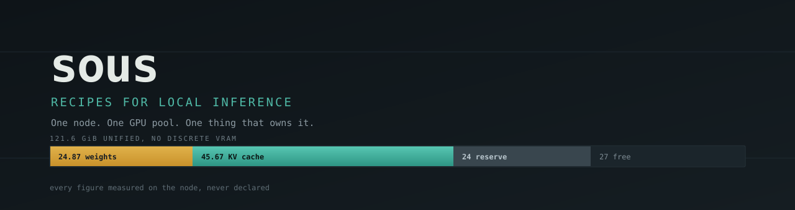

<div align="center">



**Recipes for local inference.** Store a model's full serving configuration, check whether it
fits before you start it, deploy it on a free port, and see what it actually did.

[](https://github.com/codemug/sous/actions/workflows/build.yml)
[](https://go.dev)
[](https://github.com/codemug/sous/pkgs/container/sous-api)
[](https://github.com/codemug/sous/pkgs/container/sous-api)

</div>

---

## The problem

Running two or three models on one box goes wrong in ways that are not obvious, not
documented, and not the same twice:

- **`--gpu-memory-utilization` is a startup gate, not a budget.** It is checked against *free*
  memory, so a model that fits perfectly refuses to start because another one is resident.
- **KV cost per token differs 20× between models.** 88 KiB/token for a 35B MoE, 273 for a
  "smaller" 27B dense hybrid, ~4 for a Mamba model. "Give it more KV" means something
  different every time.
- **Page cache is not counted as free.** Loading 30 GB of weights leaves 30 GB of stale cache
  behind, so the next model sizes its cache against a lie — and OOMs on a *smaller* model.
- **Two models memory-profiling at once is a documented crash.**

None of that is in a README you can find. It gets learned by losing an evening to it.

Sous encodes those as rules the machine follows, so you stop being the thing that remembers.

## What it does

```
                 PUT /api/desired  {models: [qwen38, asr, kokoro]}
                                │
  ┌─────────────────────────────▼──────────────────────────────┐
  │  catalog     recipes: model, image, flags, and the WHY      │
  │  capacity    does it fit, and by how much — never a boolean │
  │  ports       allocated at deploy time, proven by binding    │
  │  reconciler  stop before start · drop caches · serialise    │
  │  observe     boot log → measured truth, written back        │
  │  larder      weights on disk, reconciled and reclaimable    │
  └─────────────────────────────┬──────────────────────────────┘
                                │ Docker Engine API
                    qwen38 :8000 · asr :8006 · kokoro :8004
```

## Concepts

| Term | Meaning |
|---|---|
| **recipe** | A portable answer to "how do I serve this model" — model, image, kind, flags, notes |
| **source** | A git repo of recipes, mirrored read-only |
| **overlay** | Your local edits to a source recipe, as a sparse patch |
| **deployment** | A recipe plus what this node granted it: host port, container |
| **larder** | Downloaded weights on disk |
| **observation** | What the boot log actually reported — node-local, never inside a recipe |

A recipe declares a `kind`, and that changes its *shape*, not just a label:

- **`vllm`** — image plus serve flags
- **`transformers`** — a build context and an explicit entrypoint
- **`container`** — a third-party image, used exactly as published

That matters because not everything is a language model. A CPU-only TTS service costs zero
GPU, and a capacity model assuming every entry has weights *and* a KV cache is simply wrong
for it.

## Quickstart

Two binaries now: `sous-api` is the control plane (one instance — the catalog, the UI, and the
mTLS gRPC server every node dials into), `souslet` runs on every node that actually serves
models. `sous-api` alone, with no `souslet` connected, is a working single-node control plane —
it still deploys locally as a fallback — but a real fleet needs at least one `souslet`.

**1. Start `sous-api`:**

```bash
docker run -d --name sous-api \
  --privileged \
  --network host \
  -v /var/run/docker.sock:/var/run/docker.sock \
  -v /opt/sous-api:/var/lib/sous-api \
  -v /models:/models \
  ghcr.io/codemug/sous-api:latest \
    -listen 10.0.0.5:8090 \
    -grpc-listen 10.0.0.5:8091 \
    -ca-state /var/lib/sous-api/ca-state.json \
    -models /models
```

Then open `http://10.0.0.5:8090`. The catalog seeds itself on first run.

**2. Register a node and copy its cert onto it.** `node add` is a subcommand of the same binary,
run against the same `-ca-state` file the running server uses:

```bash
docker exec sous-api sous-api node add \
  -ca-state /var/lib/sous-api/ca-state.json -out /var/lib/sous-api/certs asus-gx10
```

That writes `ca.pem`, `asus-gx10.cert.pem` and `asus-gx10.key.pem` under `/var/lib/sous-api/certs`
inside the container — `/opt/sous-api/certs` on the host, per the volume above. Copy those three
files onto the node. **Restart `sous-api`** after adding a node: it loaded its CA into memory at
startup, so it will not accept a connection signed for a node added since.

**3. Start `souslet`** on that node, pointed at the cert material you just copied over:

```bash
docker run -d --name souslet \
  --network host \
  -v /var/run/docker.sock:/var/run/docker.sock \
  -v /models:/models \
  -v /opt/souslet/certs:/certs:ro \
  ghcr.io/codemug/sous-souslet:latest \
    -api-addr 10.0.0.5:8091 \
    -node-id asus-gx10 \
    -model-dir /models \
    -ca /certs/ca.pem \
    -cert /certs/asus-gx10.cert.pem \
    -key /certs/asus-gx10.key.pem \
    -pool-gib 128
```

`-pool-gib` is this node's real usable memory, not the nominal spec figure — a box specced at
128 GiB commonly reports less once the OS and firmware take their share, and planning against
the nominal number over-commits before anything is even deployed. `souslet` has no UI and no
listener of its own; it dials `-api-addr` and stays connected, reconnecting with backoff if that
drops.

**`-listen`/`-grpc-listen` (on `sous-api`) are both required and both refuse `0.0.0.0`.** Sous
creates and destroys containers — directly on `sous-api`'s own box via its local fallback path,
and remotely on every connected node once `souslet` is deployed there — which makes either
listener root-equivalent-by-proxy; the network boundary is the mitigation, so binding everything
would remove the only protection either one has.

**Why `--privileged` on `sous-api`:** its local deploy path drops page cache before every model
it starts on its own box, and `/proc/sys` is read-only inside Docker without it. Without that
drop, the next model sizes its KV cache against memory the kernel is still holding — a real OOM,
not a theoretical one. `souslet` does not need `--privileged` today; its deploy path does not yet
carry this same cache-drop step. If `--privileged` is unacceptable in your environment, run the
binary under systemd instead; it needs no container.

**Mount the model cache (`-models`/`-model-dir`) at the same path inside and out, on every box
running one of these images.** Sous hands paths to the Docker daemon, and the daemon resolves
them on the *host*.

## Design decisions worth knowing

**No ports in a recipe.** Not host, not container. Placement is decided at deploy time against
the real host with an actual bind test — because a process outside Sous can hold a port, and
checking only your own records cannot see that.

**Measured values never live in a recipe.** `24.87 GiB of weights` and `136 KiB/token` are
facts about *one box running one engine build*, not about the model. They live in
`observations/`, which is exactly what lets recipes be shared without shipping lies.

**Docker Engine API, not Compose.** Every Compose trap this was built against is a property of
Compose semantics rather than of containers: a service archived behind `profiles:` keeps
running, teardown fails when the file uses `${VAR:?}` guards, and `up -d` will not rebuild
after a Dockerfile change. Sous still writes a compose file per deployment into `exports/` —
never used to deploy — purely so a broken Sous can be worked around by hand.

**Capacity returns a margin, never a boolean.** A 2 GiB pass and a 30 GiB pass call for
different decisions, and a bare "yes" hides which one you have.

**Force separates policy from safety.** It overrides a judgement you may disagree with —
deleting rollback weights — and never overrides a guard protecting something in use.

## One endpoint for every model

Sous allocates a port per model, which means every client has to know which
model is on which port — and that mapping changes whenever anything is
redeployed. Worse, a port refuses connections for the eight to ten minutes a
model spends loading, so "is it up yet" becomes a question each client answers
badly.

The gateway removes both problems. Models are addressed by name, the way they
would be at any OpenAI-compatible provider:

```bash
curl $SOUS/v1/models -H "Authorization: Bearer $SOUS_API_TOKEN"

curl $SOUS/v1/chat/completions -H "Authorization: Bearer $SOUS_API_TOKEN" \
  -H 'Content-Type: application/json' \
  -d '{"model":"ornith","messages":[{"role":"user","content":"hello"}]}'
```

`/v1/chat/completions`, `/v1/completions`, `/v1/embeddings`, `/v1/rerank` and
the `/v1/audio/*` paths all route the same way. Streaming passes through
unbuffered, so SSE token streaming works as it does against the model directly.

A model can be named by any of its `served_as` aliases or by its recipe id;
Sous rewrites the name to whatever the upstream actually answers to, so both
work. Every deployment is listed by `/v1/models` **including ones that are not
ready**, each carrying its phase — hiding a loading model would make a client
that polls conclude it does not exist.

Requests to a model that is not ready get a described `503` rather than a
refused connection:

| phase | response |
|---|---|
| `starting` | 503 `model_starting`, with `Retry-After` |
| `stopping` | 503 `model_stopping` |
| `failed` | 503 `model_failed` |
| unknown name | 404 naming every model that *is* deployed |

**It is not a load balancer.** Envoy AI Gateway fans out across replicas and
providers; this fronts one node where each model is a singleton. A request that
cannot be served says so immediately rather than being queued, and is never
quietly sent to a different model than the one asked for.

Envoy AI Gateway was the reference for the surface and covers all of it,
text-to-speech included — `/v1/audio/speech` shipped in their v0.6.0. (Their
own supported-endpoints doc page still omits it; the merged PR is #1831.) So
the reason for a local gateway is **not** a missing endpoint.

The reason is that Envoy solves a different problem. It fronts many replicas of
many providers, injects credentials, rate-limits by token, and needs Envoy
Gateway and its CRDs running alongside. This node has one replica of each model
and no second provider to route between. What it actually needs is the one
thing Envoy cannot know: **which models are deployed right now and whether they
have finished loading.** That lives in Sous's deployment records, so the
routing table and the readiness signal are the same data structure — which is
why a `starting` model here answers 503 with a reason instead of refusing a
connection.

If this fleet ever grows a second node or a hosted provider to fail over to,
Envoy is the right answer and this becomes the thing behind it.

## Downloading models

Give it a HuggingFace repo id and it fetches the weights into the same cache
deployments read from:

```bash
curl -X POST $SOUS/api/fetch -H "Authorization: Bearer $SOUS_API_TOKEN" \
  -H 'Content-Type: application/json' -d '{"repo":"Qwen/Qwen3.6-35B-A3B-FP8"}'
```

Or from the Larder page, which is where the rest of "what is on disk" lives.

**Why this exists rather than letting a deploy pull.** vLLM downloads weights
itself on first start, inside the serving container, silently. On a node where a
large model usually needs another one *stopped* to fit, that turns a deploy into
"stop the chat model, wait twenty minutes for 37 GiB, then start" — with the
dashboard reporting `starting` throughout and nothing saying a download is even
happening. Fetching separately makes it visible and moves it out of the window
where something else is down.

It runs as a one-shot container from an image carrying `huggingface_hub` — the
host has neither `hf` nor an importable copy — writing into the bind-mounted
cache, so the same client that writes the weights is the one that later reads
them. Returns `202` immediately; progress and failures are read back from the
job's own container state and logs, so there is no record to drift.

Asking twice for the same repo joins the running job rather than starting a
second container writing into the same directory.

## API keys

The gateway is behind the same guard as everything else, so a client needs a
credential. The obvious one — `SOUS_API_TOKEN` — is **root-equivalent**: it can
deploy, undeploy and delete recipes. Giving that to a notebook so it can call a
model hands the notebook the ability to destroy the node, and revoking it later
breaks every other caller at the same time.

So keys issued from the dashboard reach the **inference surface and nothing
else**. A leaked key spends GPU time; it cannot change what is deployed.

```bash
curl $SOUS/v1/chat/completions \
  -H "Authorization: Bearer sk-sous-…" \
  -H 'Content-Type: application/json' \
  -d '{"model":"…","messages":[{"role":"user","content":"hello"}]}'
```

It also works as the `api_key` in any OpenAI client with `base_url` pointed at
`$SOUS/v1`, because most client libraries send a lone secret in the basic-auth
password field.

A key can be **limited to particular models**:

```bash
curl -X POST $SOUS/api/keys -H "Authorization: Bearer $SOUS_API_TOKEN" \
  -H 'Content-Type: application/json' \
  -d '{"name":"voice demo","models":["asr","kokoro"]}'
```

An empty list means every model, which is what every key issued before scoping
existed already had — a security feature that silently revokes credentials on
upgrade is one nobody deploys. A scoped key asking for a model it does not carry
gets **403**, not 404: the model is real, and the caller should learn their
credential is the problem rather than go hunting for a typo. `/v1/models` lists
only what the key can reach, so it never advertises a model every request for it
will be refused.

Keys are **stored as SHA-256 hashes** and the plaintext is shown exactly once,
at creation. It is not recoverable afterwards by anyone, including whoever runs
the process — a store that can show a key back to a browser can show it to
anyone who reaches the store. The list keeps the last six characters so you can
match a key you hold against a row without revealing anything useful.

Revoking **disables without deleting**. The row is the only evidence that the
key existed, what it was called and when it was last used, and that last one is
the question actually asked after a leak. Deleting is available for keys that
were never used.

Last-used timestamps are buffered and flushed on a timer rather than written per
request, because a key used in a streaming loop would otherwise rewrite its own
file once per token.

## Phases, and why "running" was not enough

A container that exists is not a model that works. On this hardware a vLLM
model is `running` for eight to ten minutes — loading weights, compiling,
capturing CUDA graphs — before it answers anything.

| phase | meaning |
|---|---|
| `starting` | container up, port not answering yet |
| `ready` | the port answers; the only phase that means usable |
| `failed` | crashed, OOM-killed, or restarting |
| `stopping` | an undeploy is in flight |
| `gone` | a record with no container behind it |

Phases are derived on every read and never stored — a stored phase starts lying
the moment a container dies outside Sous. Readiness is a port that *answers*,
and failure is checked before readiness, because a crash-looping container
passes through `running` repeatedly and would otherwise be caught mid-loop and
called healthy.

Undeploy returns `202` immediately and reports `stopping` until the container is
actually gone. Docker's stop carries a 60-second grace period and a 61 GiB model
uses most of it; holding the request for that long is indistinguishable from a
broken button.

## Recipes are distributable

A **source** is a git repo of recipe YAML, mirrored read-only. Your edits live as sparse
**overlays** carrying the upstream sha they were written against, which gives a fetch all
three sides of a real merge instead of last-write-wins.

The merge is **field-level, not line-level**, and that is what makes overlays tractable here:
a recipe is a flat `args` map and a few scalars, so upstream raising `max-model-len` while you
overrode `gpu-memory-utilization` merges silently and you keep the improvement. Only a
collision on the *same key* needs a human, and it renders as a table — not a text conflict.

Fetch is explicit and **never deploys anything**.

## Layout

```
internal/recipe      the portable schema and its validation
internal/catalog     recipes, sources, overlays, effective resolution
internal/capacity    does it fit, and by how much
internal/ports       deploy-time allocation, verified by binding
internal/engine      recipe → container spec, and the Docker client
internal/deploy      the ordering rules: serialise, drop caches, stop-then-start
internal/observe     boot log → measured truth
internal/larder      weights on disk, reconciled and reclaimable
internal/sources     read-only git mirrors
internal/overlay     sparse patches and a field-level three-way merge
internal/httpapi     JSON API and the server-rendered UI
```

## Tests

```bash
go test ./...
```

The interesting ones assert behaviour that is expensive to relearn: that a redeploy stops the
old container *before* starting the new one, that page cache is dropped before anything
starts, that `352,000 tokens` does not parse as `352`, and that `PIECEWISE` stays
distinguishable from `FULL_AND_PIECEWISE` — because that distinction is the entire explanation
for a throughput difference that produces no error message.

## Status

Works, and runs the node it was written for: a single NVIDIA GB10 with 121.6 GiB of unified
memory and no discrete VRAM, which is the constraint that shaped every decision here.

The capacity reserve is calibrated on five measured combinations and is the weakest
quantitative part of the design — deliberately conservative, so it will sometimes refuse a set
that would in fact fit. `force` is the escape hatch; accumulating observations is how it gets
better.

## License

MIT — see [LICENSE](LICENSE).
